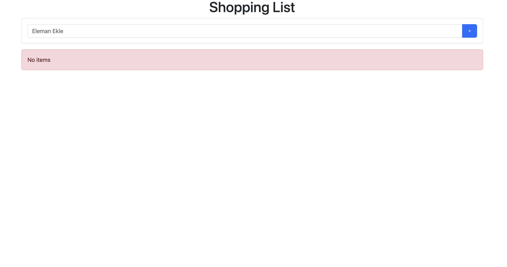
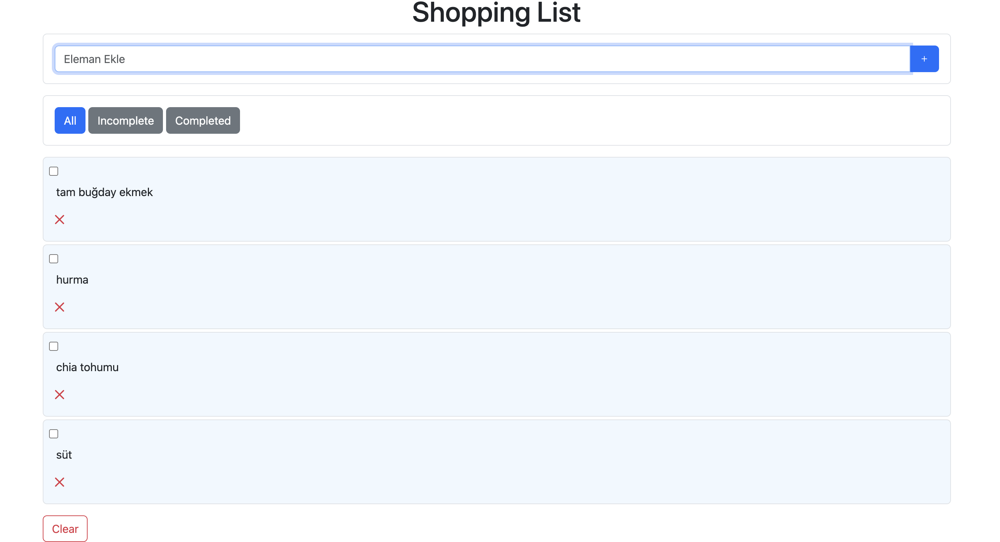
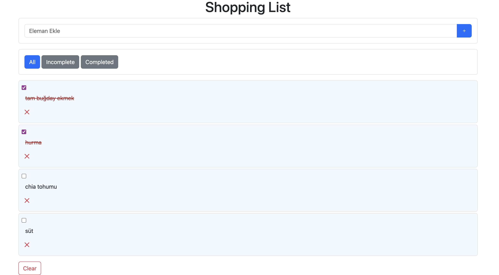
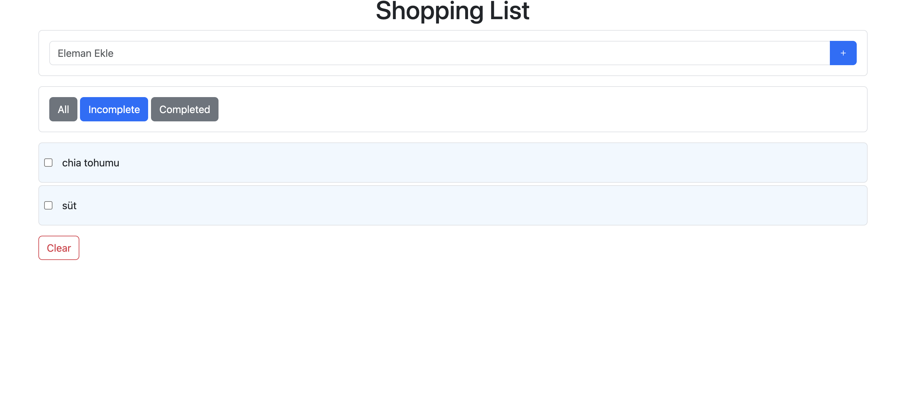
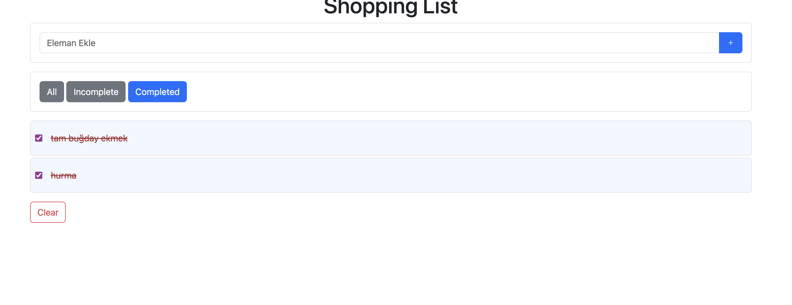

# Shopping List

A simple **Shopping List Application**.  
Users can add products, remove them, and mark them as completed.  
Additionally, products can be filtered as **All**, **Completed** or **Incomplete**.

## Technologies Used

- HTML  
- CSS  
- JavaScript   
- LocalStorage 

## Features

- Add products  
- Remove products  
- Mark products as completed  
- Filter products: All, Completed, Incomplete

## Setup / Installation

1. Clone the repository or download it as a ZIP file:  
   git clone https://github.com/YaremMalta/ShoppingList.git
2. Open the `index.html` file in your browser.  
3. Start using the application.  

## Usage

1. Type the product name in the input field and click the **Add** button.  
2. Check the checkbox to mark a product as completed.  
3. Click the red cross icon to remove a product.  
4. Use the filter buttons to view all products, completed products or incomplete products.

## Screenshots

